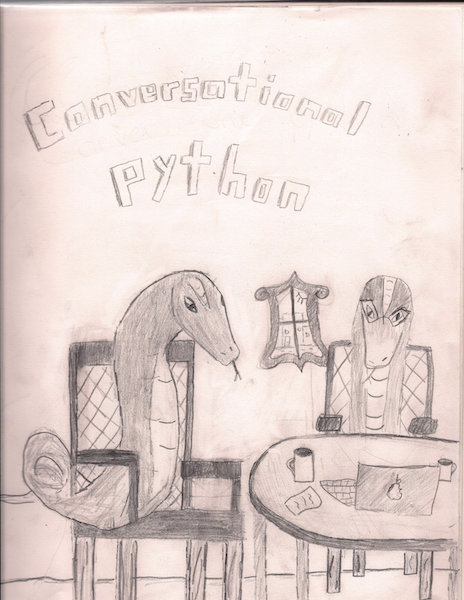

# conversational-python



Conversational Python is an introduction to computer science in Python using a format that is more like a conversational tutorial than a textbook.

This is the most recent edition of the textbook. It is organized and assembled using [Sphinx](https://www.sphinx-doc.org/) and [reStructuredText](https://www.sphinx-doc.org/en/master/usage/restructuredtext/).  The first edition was created using softcover.io and Markdown.  The repository for the first edition can be found [here](https://github.com/jbshep/conversational-python-legacy). 

# Setup

```
python3 -m venv env
source env/bin/activate  # or on Windows, source env/Scripts/activate
pip install -r requirements.txt
```

# Building the HTML or PDF version

```
cd docs

# Then, either:
make html

# Or:
make latexpdf
```
