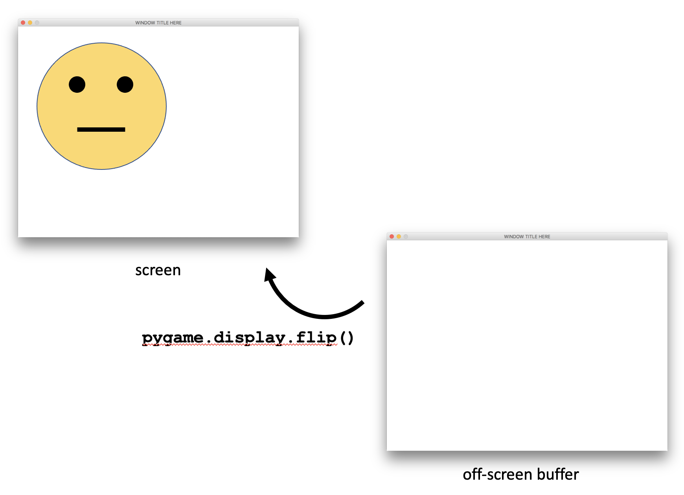
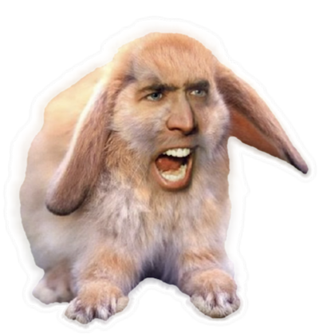

.. include:: <isonum.txt>

.. _ch_classes:

Classes, Object-Orientation, and Pygame
=======================================

.. _sec_getting_started:

Getting Started
---------------

You're still reading this book?!  Hurray!  Good for you.  Now that you're here,
you'll be pleased to know that this is the best chapter of the whole book, so
pay attention!

Thus far, all of our programs have been text-only programs.  In this chapter, we
will make programs that have graphics.  To do this, we'll use a Python code
library named *Pygame*.  Very shortly, we'll learn how to install Pygame on your
computer.  Then, we'll write some simple graphical programs and eventually
animate the graphics to make them move around the screen.

Cool, huh?

Eventually, we will reach a point in this chapter while learning about graphics
where things will get a little frustrating.  We will want to detect when two
graphical things collide with one another, and that will seem hard to
manage, especially when we have lots of graphical things flying around the
screen.  So, we will need to learn about things called
*objects* and *classes* that will help us tremendously, and will make
programming graphical video games way more fun.

Let's get started by installing Pygame.  Open Thonny and find the ``Tools`` menu.
Under the ``Tools`` menu you will see an option named "Manage packages..."  Click
that option.  A dialog window will be displayed to you.  The dialog has a
textbox and a button at the top of its window.  Enter "pygame" into the textbox
and press the button (which reads "Find package from PyPI").  Information about
the ``pygame`` package should then be displayed in the main part of the dialog
window, and beneath it should be a button labeled "Install".  Click the
"Install" button.  After pygame has installed, click the "Close" button.

How do you know if the installation worked?  In the Python shell window, you
should be able to type ``import pygame``.  If nothing bad happens, it worked!  If
instead that statement makes Python puke red text, it did not work.  At that
point, you may wish to solicit help from the nearest knowledgeable, techie human.

Assuming everything worked, it's time to write code that uses Pygame!

.. _sec_basic_graffiti:

Basic Pygame: Drawing Graffiti
------------------------------

Pygame can do a lot for us as programmers.  Pygame can make a separate window to
display our graphical program.  Pygame then allows us to draw graphics on that
separate window.  Using Pygame, we can draw different types of graphics (shapes,
colors, etc.), play sounds, and use a whole host of other features.

Because Pygame does a lot, the first Pygame program you see might look a bit
daunting.  So, let's dive in.  You can see our first Pygame program in
Listing :numref:`%s <pygame_template>`, and if you'd like to avoid typing this code
or using copy/paste, you can download the code directly from `this
link <https://raw.githubusercontent.com/jbshep/conversational-python/master/code/pygame-template.py>`_.

In the paragraphs that follow, we will break down
Listing :numref:`%s <pygame_template>` section by section.

.. _pygame_template:
.. code-block:: python
   :linenos:
   :caption: A basic Pygame code template

   import pygame
   from pygame.locals import *
   
   pygame.init()
   
   white = (255, 255, 255)
   black = (  0,   0,   0)
   green = (  0, 255,   0)
   
   screenwidth = 800
   screenheight = 600
   screensize = [screenwidth, screenheight]
   screen = pygame.display.set_mode(screensize)
   pygame.display.set_caption("WINDOW TITLE HERE")
   
   clock = pygame.time.Clock()
   
   done = False
   
   while not done:
       # 1. Process events
       for event in pygame.event.get():
           if event.type == pygame.QUIT:
               done = True
   
       # 2. Program logic, change variables, etc.

       # 3. Draw stuff
       screen.fill(white)
       pygame.draw.line(screen, green, [100, 200], [150, 300], 3)
       pygame.draw.line(screen, green, [150, 300], [200, 200], 3)
   
       pygame.display.flip()
       clock.tick(20)
   
   pygame.quit()

The result of the code in Listing :numref:`%s <pygame_template>` is the window shown in Figure :numref:`%s <fig_pygame_template>`.

.. _fig_pygame_template:
.. figure:: images/ch9/pygame_template.png
   :scale: 30 %
   :alt: The window produced by the code in Listing :numref:`%s <pygame_template>`

   The window produced by the code in Listing :numref:`%s <pygame_template>`

That's a lot of code to throw at someone, or at least it seems that way right
now.  It's actually not a huge deal if we just slow down and take this code step
by step.  We'll look at a block of code and then we'll explain what it does.

.. code-block:: python

   import pygame
   from pygame.locals import *
   
   pygame.init()

The first two lines in this code snippet make it so we can use Pygame variables
and functions in our code.  The last line gets Pygame ready to start making
graphical windows.  

.. code-block:: python

   white = (255, 255, 255)
   black = (  0,   0,   0)
   green = (  0, 255,   0)

In this code snippet, we define colors that we think we'll use in our program.
Colors are "mixed" together using amounts of red, green, and blue (in that
order, specifically).  The amounts of each range from ``0`` to ``255``.  Thus, when
we type ``green = (0, 255, 0)``, we are telling Python to make a color that has
``0`` of red, lots of green (that is, ``255``, which is the maximum), and ``0`` of
blue.

You might be wondering what the parentheses do.  Note that this:

.. code-block:: python

   (0, 255, 0)

Kind of looks like this:

.. code-block:: python

   [0, 255, 0]

Notice all we did was change the type of braces -- parentheses versus square
brackets.  We know that square brackets surround lists.  If we use parentheses,
it makes a list-like thing called a *tuple*.  A tuple is a list that cannot be
changed once it is created.  We use tuples to make colors.

Sometimes students are confused by the indentation I've used in the above code
snippet.  Here is the code again:

.. code-block:: python

   white = (255, 255, 255)
   black = (  0,   0,   0)
   green = (  0, 255,   0)

Notice the extra spacing around the zeroes.  This extra spacing doesn't do
anything special.  It just makes the code look more readable. You're allowed
(and encouraged) to be artistic in writing code.  Make your code pretty!

.. code-block:: python

   screenwidth = 800
   screenheight = 600
   screensize = [screenwidth, screenheight]
   screen = pygame.display.set_mode(screensize)
   pygame.display.set_caption("WINDOW TITLE HERE")

This code actually creates a graphical window.  It chooses a width and height
and then uses the function ``pygame.display.set_mode`` to set up the window, which
makes it appear on the screen for the first time.  The part of the code that
reads ``pygame.display`` is the name of a code module that contains the ``set_mode``
function.  Much of the code in Pygame is stored in different modules that have
descriptive names.

The last line changes the text in the title bar of the window.  This text is
called the window's *caption*.

.. code-block:: python

   clock = pygame.time.Clock()

This line of code creates a "clock" that "ticks."  We'll talk more about what
this ``clock`` variable is for in a little bit, but for now just remember that we
created a variable named ``clock``.

.. code-block:: python

   done = False
   
   while not done:

You've seen loops a lot in this book.  Often, we've used loops to repeatedly ask
for a number, a string, or a value in a list.  In this case, the loop is going
to repeatedly draw things on the screen.

Computer programs that create graphics don't just draw those graphics on the
screen and then wait.  Computer monitors continually refresh their graphics
on-screen, so programs need to be written to continually re-paint their shapes,
colors, and images.  This is the start of the loop that accomplishes this.

We create a Boolean variable named ``done``.  The loop will keep running until
``done`` is ``True``.  Presumably, something inside the loop will change ``done``
from ``False`` to ``True``.  We'll see that very shortly.

.. code-block:: python

   # 1. Process events
   
   # 2. Program logic, change variables, etc.

   # 3. Draw stuff

Okay, so I've removed some code so that you can focus on the three main comment
sections of the loop.  In fact, I've labeled them 1, 2, and 3.  Each time
through the loop, we're going to do three basic things.  

First, we'll handle events.  Events are things like the user pressing a keyboard
key or moving the mouse.

Second, we'll perform program logic.  If we want to change where graphics show
up on the screen, or possibly check to see if there are any collisions between
our graphics, we would do that in this section of code.  We will use variables
to keep track of where things should appear on the screen, and in this section
we will update the values of those variables.

Third and finally, we'll use the variables modified in the second section of
code to actually draw shapes on the screen.

It is a really good idea to stick to this organization in the loop.  Consider if
we decided to try to draw something on-screen in part 1.  It is possible that
whatever we drew would end up erased or overwritten in part 3.  This would also
make our code really hard to debug.

Now, let's look at the code under each of these comment sections.

.. code-block:: python

   # 1. Process events
   for event in pygame.event.get():
       if event.type == pygame.QUIT:
           done = True

The function ``pygame.event.get`` gives us a list of all the events that have
happened to the program.  This could be mouse clicks, key presses, etc.  We are
using a ``for`` loop to cycle through the events, one at a time.  If the event
happens to be a ``pygame.QUIT`` event, this tell us that the user has clicked on
the "close" button typically found at the top corner of the window.  We should
respond by setting ``done`` to ``True`` so that the loop can exit at the top of the
``while`` loop and then the program can end.

In future Pygame programs, we will handle more types of events in different
ways.

.. code-block:: python

   # 2. Program logic, change variables, etc.

There's no code in this section right now.  This is because in this code sample,
all we are doing in the next section (part 3) is drawing two lines at
fixed locations.  There is no real program logic.

.. code-block:: python

   # 3. Draw stuff
   screen.fill(white)
   pygame.draw.line(screen, green, [100, 200], [150, 300], 3)
   pygame.draw.line(screen, green, [150, 300], [200, 200], 3)

Think of drawing on the screen in Pygame as being like painting on a wall or a
canvas.  When we start painting on a surface, we want to make sure the canvas is
clear and uniform.  If our canvas already had drawings on it and we wanted to
start over, perhaps we could paint over the existing drawings using one
background color.  That is what we accomplish in the first line with
``screen.fill(white)``.

Each of the next two lines of code draw a single line using the ``green`` color on
the ``screen`` variable we created earlier.  The ``pygame.draw.line`` function
accepts five arguments.  The first is the ``screen``.  The next is the color.  The
third and fourth arguments are lists, each of which represents a point on the
screen.  The points are the ends of the line segment we wish to draw.  Each list
is of the form ``[X, Y]`` where ``X`` is the x-coordinate and ``Y`` is the
y-coordinate.  Each X/Y point is called a **pixel**.  However, the X's and
Y's work a little differently than what you might be used to in past mathematics
courses or other experiences in life.

In Figure :numref:`%s <fig_xy_plot>`, we can see that as X goes from the left side of the screen
to the right side of the screen, the X value gets bigger.  It starts at zero
on the left side of the screen, and it gets bigger until it reaches the
pixel width value of the screen (which, in this example code, we have set to
``screenwidth = 800``).  Also in Figure :numref:`%s <fig_xy_plot>`, we can see
that as Y goes down from the top of the screen to the bottom of the screen, the
Y value gets bigger.  This is probably backwards from what you have experienced
in mathematics.  The Y values start at zero on the top of the screen and get
larger until the Y value reaches the pixel height value of the screen's height
(which, in the example code, we have set to ``screenheight = 600``).
Additionally in Figure :numref:`%s <fig_xy_plot>`, we can see the X/Y points
that describe the endpoints of the two green lines drawn using ``pygame.draw.line``.

.. _fig_xy_plot:
.. figure:: images/ch9/xy-plot.png
   :scale: 40 %
   :alt: Using the X/Y coordinate system to draw on a screen

   Using the X/Y coordinate system to draw on a screen

Close to the end of the loop body are the following two statements.

.. code-block:: python

   pygame.display.flip()
   clock.tick(20)

As we use functions from the ``pygame.draw`` library, these functions
actually draw graphics off-screen on something called a graphics "buffer."
When the time comes to show our final work of art, we "flip" the on-screen
and off-screen buffers so that what we've drawn finally appears on the
screen.  The technical name for this is called *double buffering*.
If we didn't use double buffering, it's possible the user would perceive
each line-draw stroke and the drawing process would look choppy.  Just know
that we need to call ``pygame.display.flip()`` near the end of the loop
body to make our graphics appear.  Figures :numref:`%s <fig_pre_flip>`  
and :numref:`%s <fig_post_flip>` demonstrate the effect of flipping our
double buffered displays if we had just drawn a face on the off-screen
buffer.

.. _fig_pre_flip:
.. figure:: images/ch9/pre-flip.png
   :scale: 30 %
   :alt: Before calling ``pygame.display.flip``

   Before calling ``pygame.display.flip``

.. _fig_post_flip:

   After calling ``pygame.display.flip``

The statement ``clock.tick(20)`` controls the *framerate* of the program.
This introduces a small delay in the loop.  Eventually in this chapter,
we will begin animating our graphics.  Animation is simply the process of
drawing graphics at slightly different coordinates on the screen.  A person's
vision interprets images drawn at slightly different locations over time
as movement.  The small delay introduced by ``clock.tick`` helps a human
being to perceive these changes in position over time.  The argument passed
to ``clock.tick`` (in this case, ``20``) is the framerate in milliseconds.

Finally, once the program leaves the loop body, the code executes the
following code.

.. code-block:: python

   pygame.quit()

``pygame.quit()`` closes the window.  If we forget to call ``pygame.quit()``,
the program will freeze and we will need to terminate the program through
another means (like the Windows Task Manager or the macOS Force Quit feature)..

We need to be able to draw more than just lines.  Let's consider ellipses
(which include circles) and rectangles.

To draw an ellipse, do this:

.. code-block:: python

   pygame.draw.ellipse(screen, green, [400, 300, 200, 150], 2)

   # The arguments used are:
   #
   # screen is the surface window on which we wish to draw
   # green is the color tuple
   # [400, 300, 200, 150] is the list describing the X/Y position
   #   of the ellipse and the width and height of an invisible
   #   rectangle surrounding the ellipse
   # 2 is the pixel width of the border surrounding the ellipse
   #
   # Thus, this statement draws an ellipse inside an invisible
   # rectangle whose upper left corner is at [400,300] that 
   # is wider (200 pixels) than it is taller (150 pixels).  It
   # draws the ellipse with a green border.

We can change the pixel width to 0, and it will fill in the ellipse instead
(rather than changing the border color), like this:

.. code-block:: python

   pygame.draw.ellipse(screen, green, [400, 300, 200, 150], 0)

To draw a rectangle, do this:

.. code-block:: python

   pygame.draw.rect(screen, green, [400, 300, 200, 150], 2)

Knowing what you now know about drawing lines and ellipses, can you draw
the face in Figure :numref:`%s <fig_pre_flip>`?  Give it a try!

How did you do?  Did you realize you needed to create a yellow color first?
Then, did you notice that the yellow circle had a black border around it?

Here is one way you could have drawn the face.  Notice line 8 that
defines ``yellow``.  Then, notice lines 32 - 33.  To get a yellow
circle with a black border, we actually draw the circle twice.  First,
we draw the yellow circle using ``pygame.draw.ellipse``.  Then, we draw
the same circle over the top, only this time we only draw a black border.

.. code-block:: python
   :linenos:
   :emphasize-lines: 8,32,33

   import pygame
   from pygame.locals import *

   pygame.init()

   white = (255, 255, 255)
   black = (0, 0, 0)
   yellow = (255, 255, 0)

   screenwidth = 800
   screenheight = 600
   screensize = [screenwidth, screenheight]
   screen = pygame.display.set_mode(screensize)
   pygame.display.set_caption("WINDOW TITLE HERE")

   clock = pygame.time.Clock()

   done = False

   while not done:
       # 1. Process events
       for event in pygame.event.get():
           if event.type == pygame.QUIT:
               done = True
   
       # 2. Program logic, change variables, etc.
   
       # 3. Draw stuff
       screen.fill(white)

       # Draw the head
       pygame.draw.ellipse(screen, yellow, [50, 50, 400, 400], 0)
       pygame.draw.ellipse(screen, black, [50, 50, 400, 400], 2)
   
       # Draw the eyes
       pygame.draw.ellipse(screen, black, [145, 145, 50, 50], 0)
       pygame.draw.ellipse(screen, black, [300, 145, 50, 50], 0)

       # Draw the mouth
       pygame.draw.line(screen, black, [175, 340], [325, 340], 6)

       pygame.display.flip()
       clock.tick(20)
   
   pygame.quit()

Drawing lines, ellipses, and rectangles is a tedious exercise, but it's
worth doing to get a sense of how to draw primitive graphics on an
X/Y coordinate surface.  As we progress through this chapter, we will
find easier ways of dealing with drawing graphics, so keep reading!

The next thing we will learn to do is to take an image in a file and
draw it on the screen.  First, find an image you like.  I'm going to use
the one shown in Figure :numref:`%s <fig_niccage>`, which you can download
`here <https://raw.githubusercontent.com/jbshep/conversational-python/master/docs/source/images/ch9/niccage_rabbit.png>`_.  If you use this image, note that
the image's filename is ``niccage_rabbit.png``.

.. _fig_niccage:

   Behold! Nicolas Cage as a rabbit!

Ensure that your image is located in the same folder as your code.  This is
very important.  Then, you can use the following code to draw the image
onto the screen.

.. code-block:: python

   niccage = pygame.image.load("niccage_rabbit.png")
   screen.blit(niccage, [5, 10])

This code first loads the image into a variable named ``niccage``.  Then
We "blit" the image onto the screen at coordinates ``[5, 10]`` or wherever
we would like our image to appear.  "Blit" stands for "Block Transfer" and
it is how we copy the contents of one surface onto another.  The image
stored in our ``niccage`` variable is technically of type ``Surface``, just
like our ``screen``.

If you find an image that you want to use is too big or too small, it's best
to use an image editing program to resize it, like Photoshop or Illustrator
(or Microsoft Paint, egads!).  Resizing images in code is cumbersome and
can be costly when we have fairly sophisticated graphical programs.

If you want to draw a background image, you'll simply want to make sure
the image fills up the screen, and then you'll want to draw it at position
``[0, 0]`` so that it fits nicely up against the upper left corner of the
screen. 

There is one more important point to realize.  Graphics appear in the order
they are drawn in your code.  If you draw one graphical object A and then
another graphical object B that overlaps A, B will appear on top of A.  Thus,
if you want to have background with images drawn on top of it, you would
need to draw the background first, and then draw the other images afterwards.

.. _sec_animation:

Animation
-------------------

FIXME do move face and then bounce face

.. _sec_objects_and_classes:

Objects and Classes
-------------------

FIXME

.. _sec_sprites:

Pygame Sprites
--------------

FIXME
